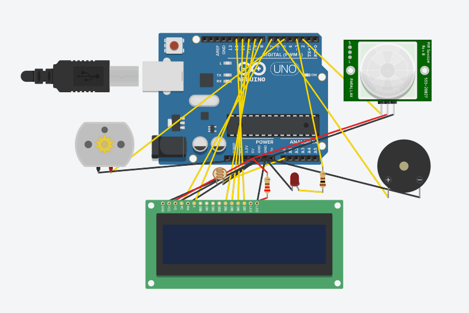

# Motion-Detection Security System (Beginner Project)

## Overview
This is my **first electronics project** as a 1st-year ECE student, built completely on my own.  
It’s a simple yet effective **motion-detection security system** using:  
- Arduino UNO  
- PIR motion sensor  
- 16×2 LCD (I2C module optional)  
- Piezo buzzer  

When motion is detected, the LCD displays a warning and the buzzer sounds an alert.  
This project helped me learn the **basics of sensors, Arduino programming, and circuit design**.

---

## Demo
👉 [Open the Simulation in Tinkercad](https://www.tinkercad.com/things/ddKGljxSWfc-watchdog-lite?sharecode=4ua88s8ErIDS6IIoiHo-deYWCmNUAwFlzWTArMDaxCs)  

### Preview
  
 

---

## Components Used
- Arduino UNO  
- PIR Motion Sensor  
- 16×2 LCD Display  
- Potentiometer (for LCD contrast)  
- Piezo Buzzer  
- Jumper Wires  
- Breadboard  

---

## How It Works
1. The PIR sensor detects motion within its range.  
2. If motion is detected:  
   - The **LCD displays** “Motion Detected!”  
   - The **buzzer sounds** an alarm.  
3. If no motion:  
   - The LCD displays “No Motion.”  
   - The buzzer stays silent.  

---

## Code
The Arduino sketch is included in this repo under `motion_detection.ino`.  
You can upload it directly to your Arduino UNO using the Arduino IDE.

---

## Future Improvements
- Add a relay + light/door lock system for real-world applications.  
- Replace the buzzer with a GSM module for SMS alerts.  
- Use IoT platforms (Blynk/ThingSpeak) for cloud monitoring.  

---

## Author
👤 **Nakul**  
- 1st-year Electronics & Communication Engineering student  
- Passionate about learning **Arduino, AI/ML, and embedded systems**  

